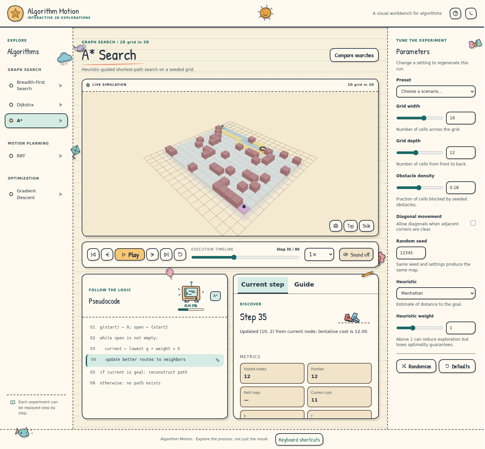

# Algorithm Motion

A static, browser-only workbench for learning algorithms through interactive 3D simulations. Explore each algorithm one frame at a time, inspect its state, tune parameters, and share a deterministic experiment by URL.



Additional views: [3D RRT](docs/screenshots/rrt.png) · [Gradient descent](docs/screenshots/gradient-descent.png)

## What is included

- BFS, Dijkstra, and A* on seeded grids rendered in 3D
- Collision-aware RRT in a true 3D workspace
- Gradient descent on three selectable objective surfaces
- Playback, reverse stepping, scrubbing, speed control, camera controls, and scene selection
- Algorithm-specific parameters, presets, visible random seeds, URL sharing, and local preferences
- Synchronized pseudocode, explanations, metrics, legends, references, and a BFS/Dijkstra/A* comparison
- Responsive dark and light layouts, keyboard controls, and reduced-motion support
- A paper-notebook theme with drawn controls and stationary, colorful stickers, plus a saved chalkboard theme
- Optional step sounds that start muted, a hand-drawn server in Pseudocode, and walking shoes in Current step

The site does not need a server, database, account, or API after the static files are deployed.

The handwriting display face is [Patrick Hand](https://github.com/google/fonts/tree/main/ofl/patrickhand), distributed under the SIL Open Font License. Its license is included at `public/licenses/PatrickHand-OFL.txt`. Text, code, and formulas retain readable fallback fonts.

## Requirements and local development

Use Node.js 20.19.x or Node.js 22.12 or newer, and npm. The checked-in lockfile makes installs repeatable.

```bash
npm install
npm run dev
```

Open the local address printed by Vite. To validate or preview a production build:

```bash
npm run typecheck
npm test
npm run build
npm run preview
```

Browser tests use Playwright:

```bash
npx playwright install chromium
npm run test:e2e
```

On Linux, Chromium may also need system libraries. GitHub Actions installs these with Playwright's dependency installer. The browser tests exercise all five algorithm families, URLs, parameters, mobile layout, keyboard controls, optional sound, learning-panel characters, and accessibility checks.

## Using the workbench

Choose an algorithm on the left. Use the transport bar to play, pause, step, restart, or scrub. Set the speed from 0.25× to 4×. Drag the 3D view to orbit, scroll to zoom, and use the camera buttons for top, side, or default perspective. Click a grid cell or RRT node to inspect it.

Step sound is off each time the page opens. Select **Sound off** in the transport bar to enable short cues during playback or individual Next/Previous steps, including keyboard stepping. You can mute it again at any time. Scrubbing, jumping, restarting, and switching experiments stay silent. The server in Pseudocode changes from ready to working to playfully burned out at the end of a run. Its meter advances with the displayed step, and its screen scans during playback. The shoes in Current step follow the displayed step. The outcome badge and explanation give the actual result.

The parameter panel is generated from each algorithm's schema. Valid changes rebuild the run and reset the timeline. Presets are editable after loading. Randomize chooses a new visible seed. The URL records the algorithm and its validated parameters, including seed; copying it reproduces the experiment. A malformed value falls back to a safe default and shows a notice.

For grid searches, Compare searches runs BFS, Dijkstra, and A* on one environment. Their step indices are aligned; a run that finishes early stays on its final frame. BFS minimizes hops, while Dijkstra and A* report weighted cost where applicable. Browser execution time is not treated as a rigorous benchmark.

Shortcuts: Space plays or pauses; Left and Right step; R restarts; C resets the camera. Shortcuts do not activate while editing fields.

## Architecture

The application keeps computation, state, rendering, UI controls, and learning content separate:

| Area             | Location                       | Responsibility                                                                           |
| ---------------- | ------------------------------ | ---------------------------------------------------------------------------------------- |
| Engine           | src/engine                     | Typed module/frame contracts, seed generation, validation, URL codec, timeline, registry |
| Grid search      | src/algorithms/grid            | Shared environment and neighbor rules, BFS/Dijkstra/A* runs, 3D grid scene               |
| RRT              | src/algorithms/rrt             | 3D sampling, collision checks, tree frames, RRT scene                                    |
| Gradient descent | src/algorithms/gradient        | Objective/gradient pairs, descent frames, surface scene                                  |
| Shared UI        | src/components and src/App.tsx | Schema-driven controls, viewport, playback, learning panels                              |

Every run returns immutable, indexed frames. A frame contains algorithm state, active pseudocode lines, an event, a current-step explanation, and metrics. The renderer consumes one frame's state and never runs the algorithm itself. This makes reverse stepping, scrubbing, and deterministic replay straightforward.

The parameter schema is a discriminated union of number, boolean, select, and seed definitions. It drives both the panel and input/URL validation. Numeric definitions declare finite minimum and maximum values, a step, and an optional slider control. Algorithms can add their own parameter keys without changing the shared panel.

The registry in src/engine/registry.ts holds module descriptors. Module metadata creates navigation automatically; modules provide their renderer, presets, pseudocode, educational content, and an inspection function. The three scene renderers are lazy loaded.

## Add an algorithm

1. Create a folder under src/algorithms with pure simulation logic, a renderer, and a module descriptor. Use the contracts in src/engine/types.ts.
2. Give the module metadata, parameter definitions and defaults, presets, pseudocode, educational content, a deterministic run function, a renderer, and an inspection function.
3. Register the module in src/engine/registry.ts. The shared shell will provide playback, parameter controls, timeline, URL values, camera controls, learning panels, and navigation.
4. Add unit tests for correctness, validation, deterministic replay, and edge cases; then run the checks above.

A compact module shape:

```ts
const module: AlgorithmModule<MyState> = {
    meta: {
        id: 'example',
        name: 'Example',
        shortName: 'Example',
        category: 'Geometry',
        dimensionality: '3D',
        description: '...',
        tags: ['geometry'],
    },
    parameters: [
        {
            type: 'number',
            key: 'count',
            label: 'Count',
            defaultValue: 20,
            min: 1,
            max: 100,
            integer: true,
        },
    ],
    defaults: { count: 20 },
    presets: [{ name: 'Small', values: { count: 10 } }],
    pseudocode: [{ id: 1, text: 'initialize' }],
    education: {/* overview, intuition, complexity, applications, legend, references */},
    run: (params) => makeFrames(params),
    renderer: lazy(() => import('./ExampleScene')),
    inspect: (state, id) => inspectObject(state, id),
}
```

For randomized modules, derive separate seeded streams for environment generation and algorithm samples through src/engine/seededRandom.ts. Keep expensive inputs bounded so precomputed frames stay responsive.

## GitHub Pages deployment

The workflow at .github/workflows/pages.yml checks types, runs unit and browser tests, builds, and publishes dist on pushes to main. In the repository's **Settings → Pages**, set **Source** to **GitHub Actions**. After a successful deployment, the site is available at [brucerry.github.io/algo-motion](https://brucerry.github.io/algo-motion/).

Vite derives the repository subpath from the GitHub repository name, so a project repository is served from its usual Pages subpath. A repository named like username.github.io uses the root path. For a different static host or custom path, set BASE_PATH during the build:

```bash
BASE_PATH=/my-path/ npm run build
BASE_PATH=/my-path/ npm run preview
```

Hash routes keep algorithm links working without server rewrite rules. The source repository is [brucerry/algo-motion](https://github.com/brucerry/algo-motion).

## Current limits

Grid algorithms use a 2D logical grid presented in a 3D scene; RRT and gradient descent operate in true 3D scenes. Runs are precomputed and capped to control memory. A* optimality depends on the heuristic and movement costs; the UI labels settings that lose an optimality guarantee. PWA installation and the future algorithm catalog are not part of this initial release.
