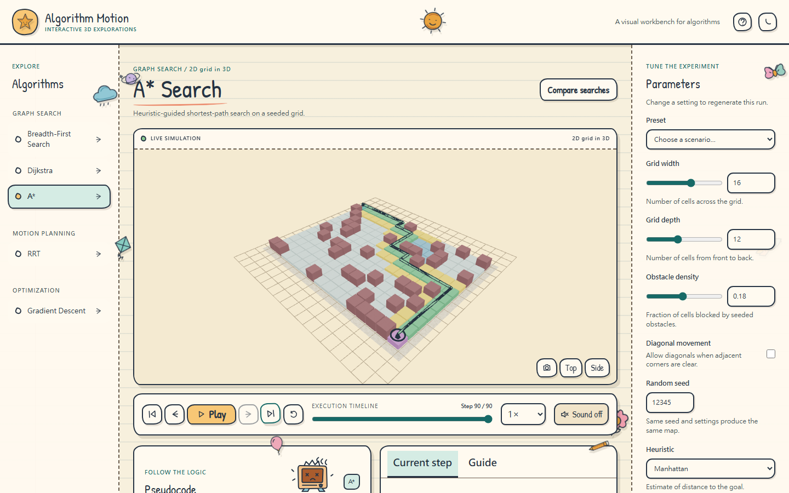

# Algorithm Motion

[](https://github.com/brucerry/algo-motion/actions/workflows/pages.yml)
[](https://www.gnu.org/licenses/gpl-3.0)

Learn algorithms through interactive 3D simulations. Step through a run, inspect its state, tune the input, and share a reproducible experiment by URL.

**[Open the live workbench](https://brucerry.github.io/algo-motion/)**



[More desktop and mobile screenshots](docs/screenshots.md)

## Explore

- **21 showcases across eight topics:** Graph Search, Motion Planning, Optimization, Sorting, Trees, Dynamic Programming, Backtracking, and Array Techniques.
- **Control every step:** play, pause, reverse, scrub, and choose speeds from 0.25× to 32×.
- **See the reasoning:** synchronized pseudocode, explanations, metrics, selection details, and comparison within a topic.
- **Make it your own:** editable presets, visible seeds, shareable URLs, notebook/chalkboard themes, and optional step sounds.
- **Use it anywhere:** desktop and mobile layouts, full 3D camera rotation, keyboard controls, and reduced-motion support.

Includes A*, RRT*, Quick/Merge Sort, Sudoku, and a tactile 3×3 Rubik’s Cube. See the [full catalog and input limits](docs/algorithms.md).

The deployed app runs entirely in your browser; no account or backend is required.

## Quick start

Use Node.js 20.19.x or Node.js 22.12 or newer, and npm.

```bash
npm ci
npm run dev
```

Open the local URL printed by Vite. To build and preview:

```bash
npm run build
npm run preview
```

See [Development](docs/development.md) for validation, browser tests, adding algorithms, and GitHub Pages deployment.

## Documentation

| Guide                                       | Contents                                                         |
| ------------------------------------------- | ---------------------------------------------------------------- |
| [User guide](docs/user-guide.md)            | Playback, camera, shortcuts, parameters, sharing, and comparison |
| [Algorithms and limits](docs/algorithms.md) | Catalog, input ranges, and algorithm-specific behavior           |
| [Design notes](docs/design-notes.md)        | Visual choices, camera motion, cube solving, and attribution     |
| [Architecture](docs/architecture.md)        | Modules, frames, workers, validation, and reproducible replay    |
| [Development](docs/development.md)          | Setup, tests, extension guide, and deployment                    |
| [Screenshots](docs/screenshots.md)          | Desktop scenes and mobile captures                               |
