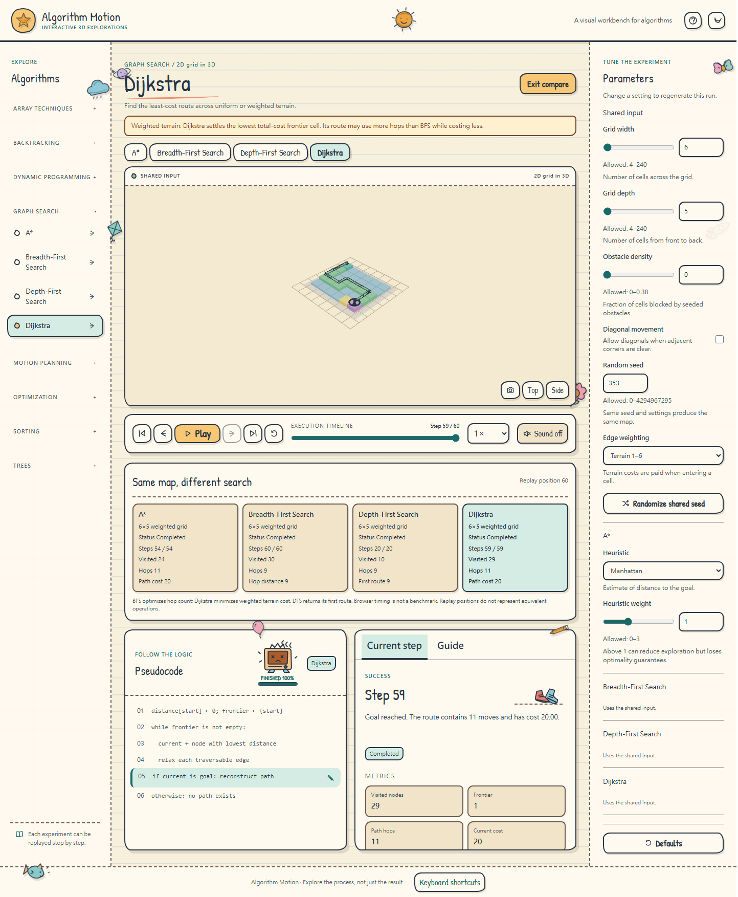
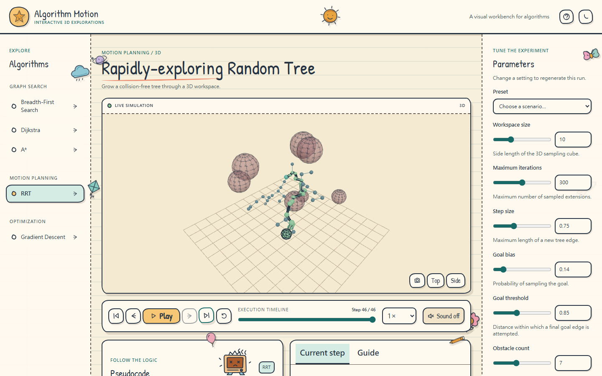
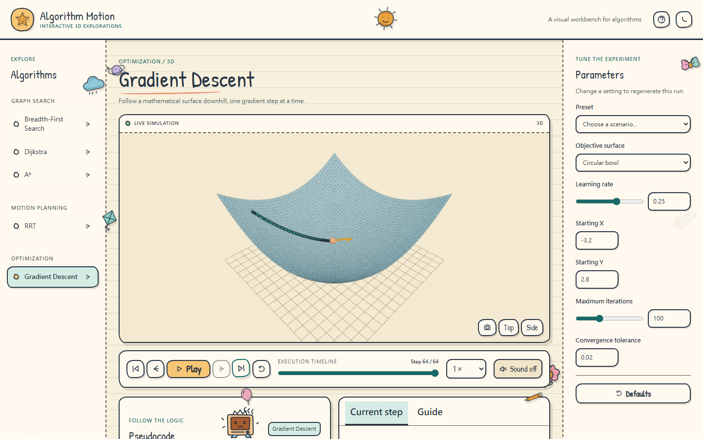
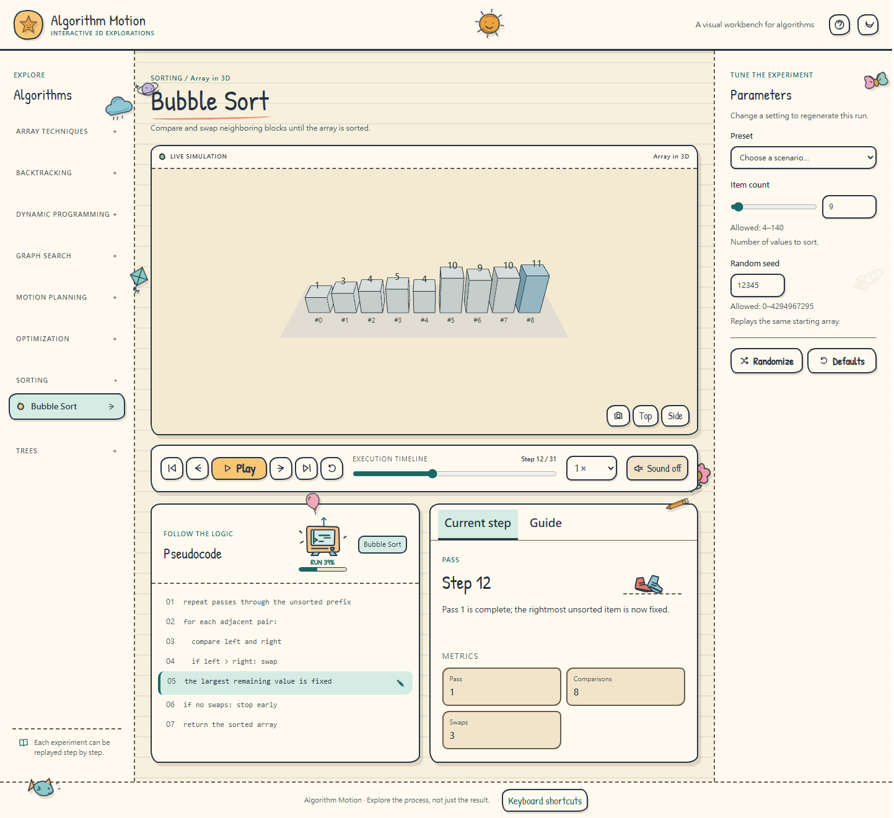
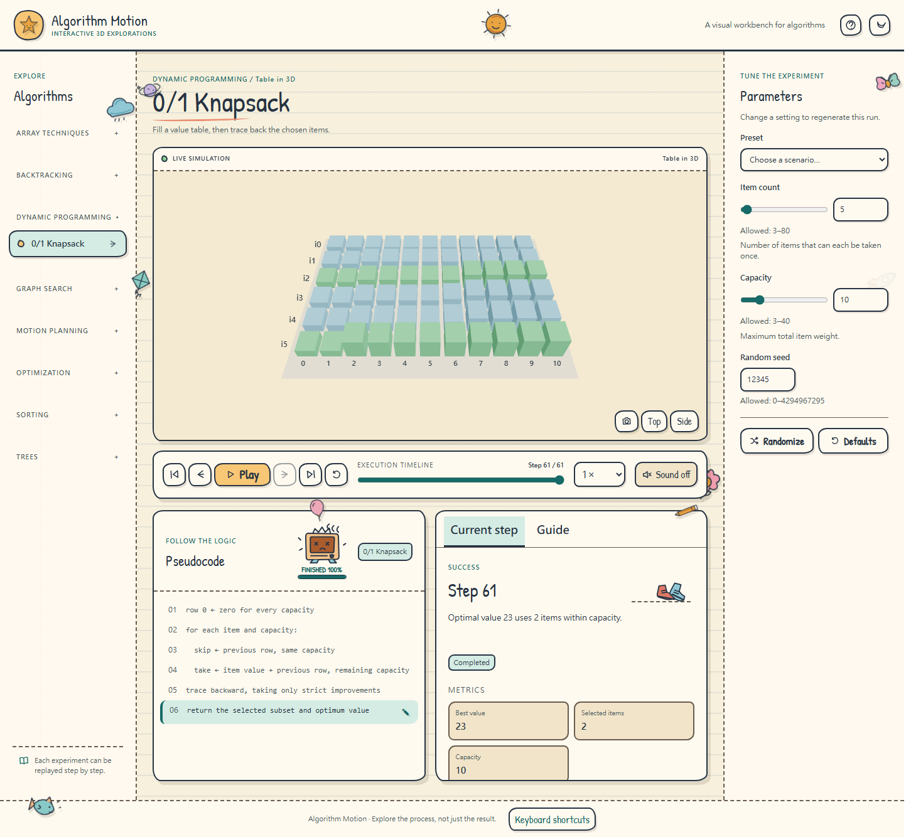
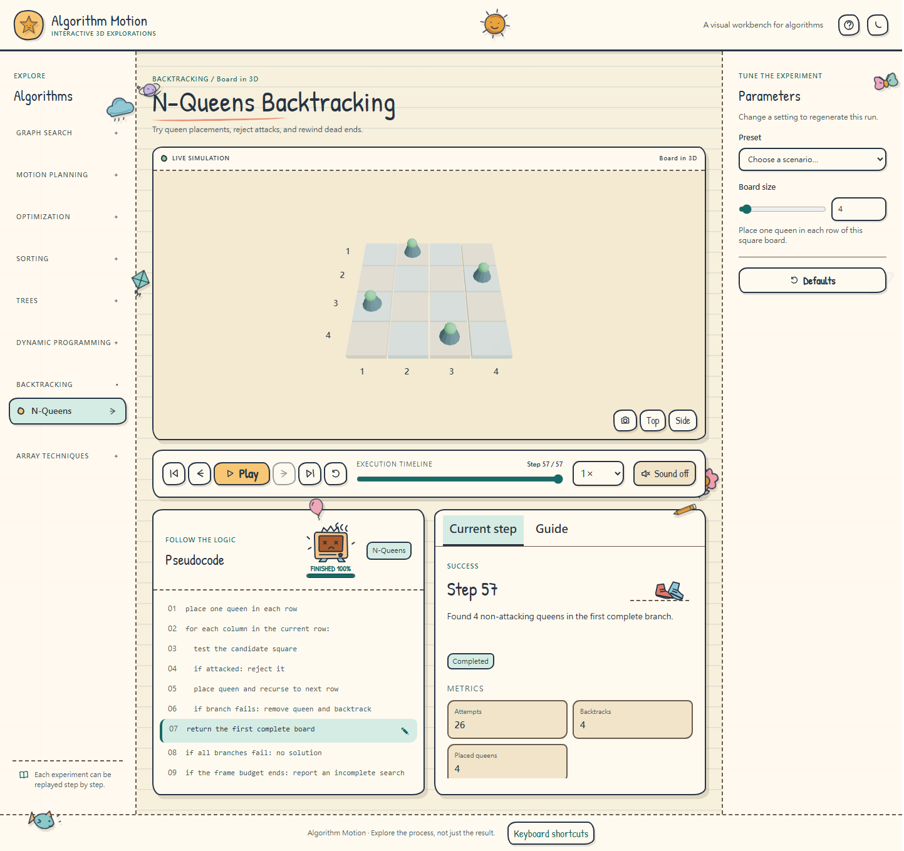
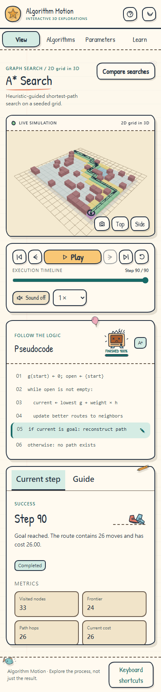
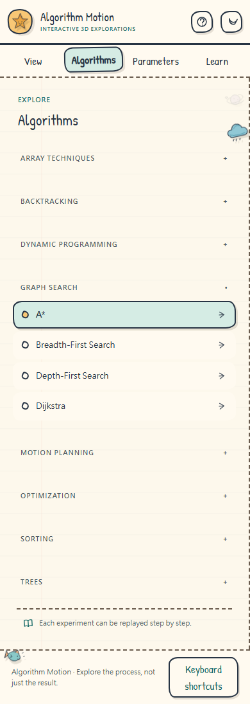
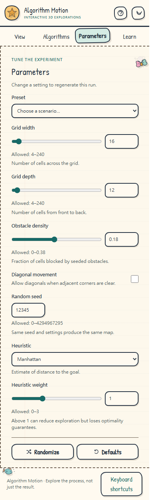
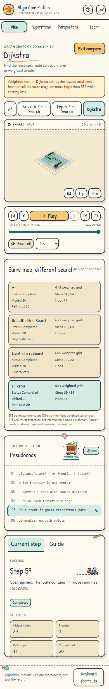

# Screenshot gallery

[Project overview](../README.md) · [User guide](user-guide.md)

Captures from the [live workbench](https://brucerry.github.io/algo-motion/). Select an image to open it at full size.

## Desktop

### A* workbench

More algorithm scenes and comparison

| Graph Search comparison                                                                                           | 3D RRT                                                                               |
| ----------------------------------------------------------------------------------------------------------------- | ------------------------------------------------------------------------------------ |
|                               |                  |
| **Gradient Descent**                                                                                              | **Bubble Sort**                                                                      |
|  |     |
| **0/1 Knapsack**                                                                                                  | **N-Queens**                                                                         |
|                         |  |

## Mobile

| A* workbench                                                                                                          | Topic navigation                                                                                                           |
| --------------------------------------------------------------------------------------------------------------------- | -------------------------------------------------------------------------------------------------------------------------- |
|  |            |
| **Parameters**                                                                                                        | **Graph Search comparison**                                                                                                |
|          |  |
